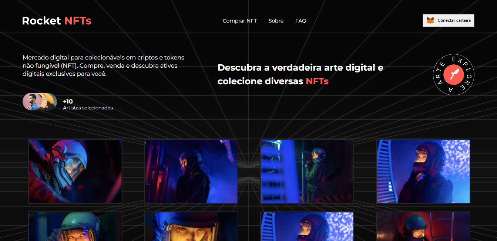
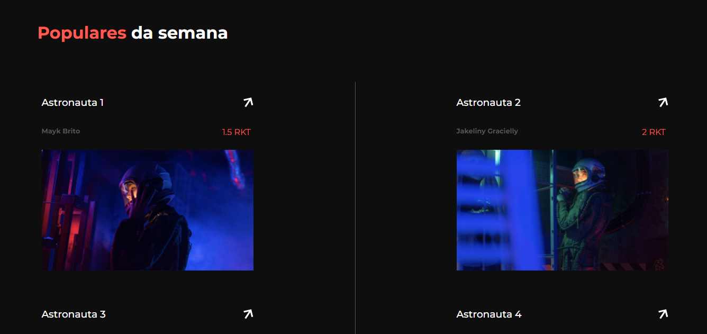
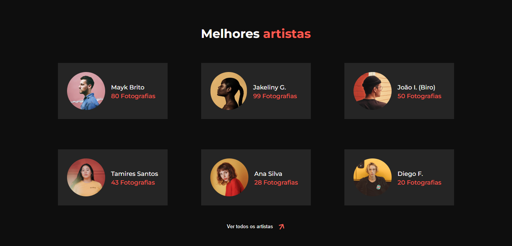

<h1 align="center">Desafio Rocket-NFTs</h1>

<h1 align="center">

</h1>

<h4 align="center">
    Acesse a aplicação online pelo 
    <a href="https://desafio-rocket-nfts-omega.vercel.app/#">link</a>.
<h4>

##  Sobre

O  projeto foi desenvolvido com finalidade didática uma vez que pertence à lista de projetos disponibilizados pela pataforma da Rocketseat como um desafio aos seus alunos no desenvolvimento de suas habilidades frontend.
Trata-se de uma landing-page sobre NFTs.

---

## Tecnologias usadas

O projeto foi desenvolvido utilizando as seguintes tecnologias:

- HTML5;
- CSS3;
- JavaScript;
- React / Styled-component;
- Vite;
- Mobile-first;
- VS Code.

---

## Acesso ao projeto
    - git clone <link-repositório> 
    - cd <diretório>
    - npm install 
    - npm start 
   
---
